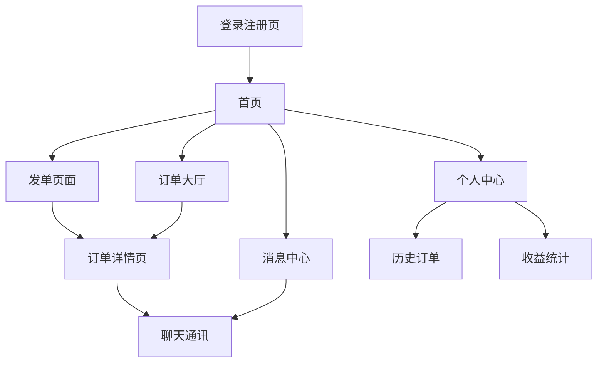

# 复旦外卖代取互助平台 - 产品需求文档

## 1. Product Overview

复旦外卖代取互助平台是一个专门服务于复旦大学宿舍区学生的外卖代取服务平台，旨在打破现有楼群信息孤岛，实现跨宿舍楼的外卖代取需求匹配。

该平台解决了复旦大学各宿舍区（东区、南区、北区、本部）学生外卖代取需求分散、信息不互通的问题，通过智能地理位置匹配和灵活定价机制，为学生提供便捷、安全的外卖代取互助服务。

平台目标是成为复旦大学校园内最主要的外卖代取服务平台，服务覆盖全校4个主要宿舍区，预计服务学生用户超过2万人。

## 2. Core Features

### 2.1 User Roles

| Role | Registration Method | Core Permissions |
|------|---------------------|------------------|
| 普通学生 | 复旦邮箱注册+学号验证 | 发布代取需求、接取订单、查看历史记录 |
| 认证代取员 | 普通学生升级+信用评级 | 优先接单权限、设置服务范围、查看收益统计 |

### 2.2 Feature Module

我们的复旦外卖代取平台包含以下主要页面：

1. **首页**：地图导航、实时订单展示、快速发单入口
2. **发单页面**：订单详情填写、定价设置、配送要求
3. **订单大厅**：订单列表、筛选搜索、抢单功能
4. **订单详情页**：订单信息、实时状态、聊天通讯
5. **个人中心**：用户信息、历史订单、收益统计
6. **消息中心**：订单通知、系统消息、聊天记录
7. **登录注册页**：学号验证、邮箱认证、密码设置

### 2.3 Page Details

| Page Name | Module Name | Feature description |
|-----------|-------------|---------------------|
| 首页 | 地图导航 | 显示复旦四个宿舍区地图，标注各楼栋位置，实时显示订单密度热力图 |
| 首页 | 实时订单展示 | 展示当前区域待接单订单，按距离和时间排序，支持快速预览 |
| 首页 | 快速发单 | 一键发单入口，智能定位当前宿舍楼，快速填写基本信息 |
| 发单页面 | 订单信息填写 | 选择取餐地点、配送地址、外卖平台、预计重量等基本信息 |
| 发单页面 | 定价设置 | 设置基础代取费、加急费、特殊要求费，系统提供建议价格区间 |
| 发单页面 | 配送要求 | 设置配送时间、特殊要求、上传图片说明、选择代取员性别偏好 |
| 订单大厅 | 订单列表 | 显示所有可接订单，支持按区域、价格、时间筛选 |
| 订单大厅 | 筛选搜索 | 按宿舍区、楼栋、价格区间、时间段等条件筛选订单 |
| 订单大厅 | 抢单功能 | 一键抢单，显示抢单成功率，支持批量接单 |
| 订单详情页 | 订单信息展示 | 完整显示订单详情、取餐和配送地址、价格明细 |
| 订单详情页 | 实时状态更新 | 订单状态实时更新（待接单/已接单/取餐中/配送中/已完成） |
| 订单详情页 | 聊天通讯 | 内置聊天功能，支持文字和图片，隐藏真实联系方式 |
| 个人中心 | 用户信息管理 | 编辑个人资料、设置服务范围、管理收货地址 |
| 个人中心 | 历史订单 | 查看发布和接取的历史订单，支持评价和申诉 |
| 个人中心 | 收益统计 | 代取员收益统计、信用评级、服务数据分析 |
| 消息中心 | 订单通知 | 订单状态变更通知、新订单推送、系统公告 |
| 消息中心 | 聊天记录 | 所有订单相关聊天记录，支持搜索和删除 |
| 登录注册页 | 学号验证 | 复旦学号格式验证，防止非本校用户注册 |
| 登录注册页 | 邮箱认证 | 复旦邮箱验证，确保用户身份真实性 |

## 3. Core Process

### 普通学生发单流程
用户登录后，在首页点击快速发单或进入发单页面，填写取餐地点、配送地址、外卖信息等基本信息，设置代取费用和特殊要求，确认发布订单。订单发布后进入订单大厅等待代取员接单，接单后可通过聊天功能与代取员沟通，实时查看订单状态直至完成。

### 代取员接单流程
代取员在订单大厅浏览可接订单，根据距离、价格、时间等因素选择合适订单，点击抢单成功后与发单用户建立联系，按约定时间前往取餐地点取餐，通过聊天功能告知取餐进度，完成配送后确认订单完成并获得收益。

## 4. User Interface Design

### 4.1 Design Style

- **主色调**：复旦蓝 (#1E3A8A) 作为主色，白色 (#FFFFFF) 作为背景色
- **辅助色**：橙色 (#F97316) 用于强调和按钮，灰色 (#6B7280) 用于次要信息
- **按钮样式**：圆角矩形按钮，主按钮使用渐变效果，次要按钮使用边框样式
- **字体**：中文使用苹方/微软雅黑，英文使用 Inter，主要字号 16px，次要字号 14px
- **布局风格**：卡片式设计，顶部导航栏，底部标签栏，响应式布局
- **图标风格**：线性图标风格，统一使用 Heroicons 图标库

### 4.2 Page Design Overview

| Page Name | Module Name | UI Elements |
|-----------|-------------|-------------|
| 首页 | 地图导航 | 全屏地图组件，使用高德地图API，自定义标记样式，热力图渐变色彩，浮动搜索框 |
| 首页 | 实时订单展示 | 底部抽屉式订单卡片，左滑查看更多，橙色价格标签，绿色距离标签 |
| 发单页面 | 表单设计 | 分步骤表单，进度条指示，输入框圆角设计，下拉选择器，图片上传区域 |
| 订单大厅 | 列表设计 | 卡片式订单列表，左侧头像，右侧价格突出显示，底部操作按钮 |
| 订单详情页 | 状态展示 | 顶部进度条，时间轴样式状态展示，底部固定聊天入口 |
| 个人中心 | 信息展示 | 顶部用户卡片，统计数据网格布局，列表式菜单项 |

### 4.3 Responsiveness

平台采用移动端优先的响应式设计，主要适配手机端使用，同时兼容平板和桌面端。支持触摸手势操作，如左滑删除、下拉刷新等，针对移动端网络环境进行优化。