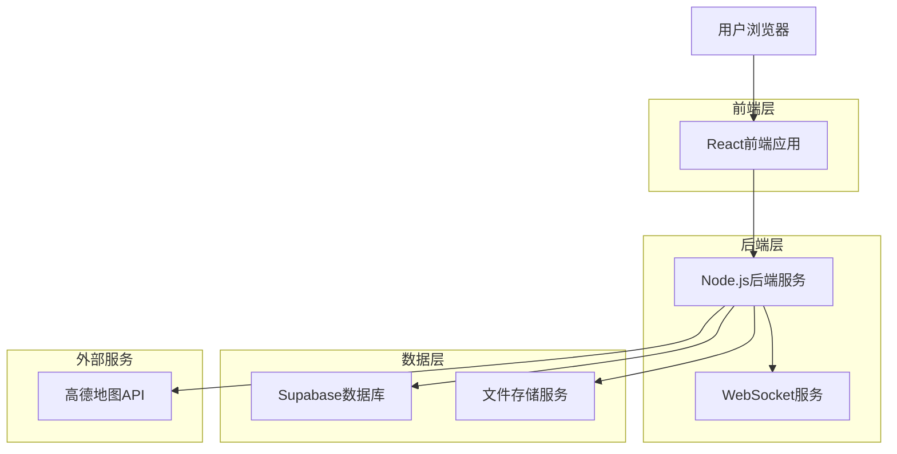
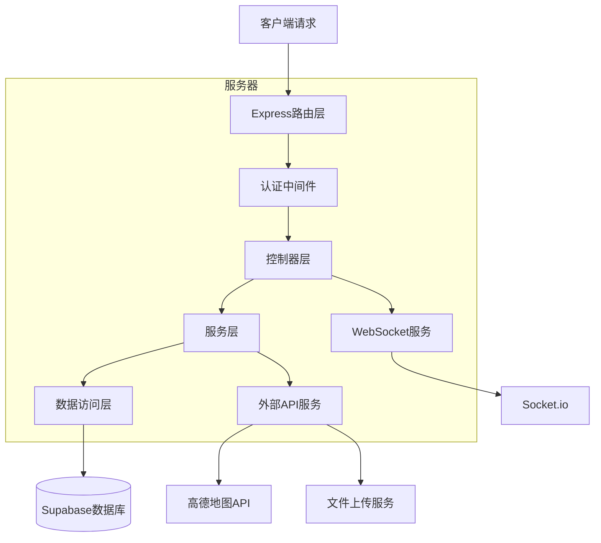
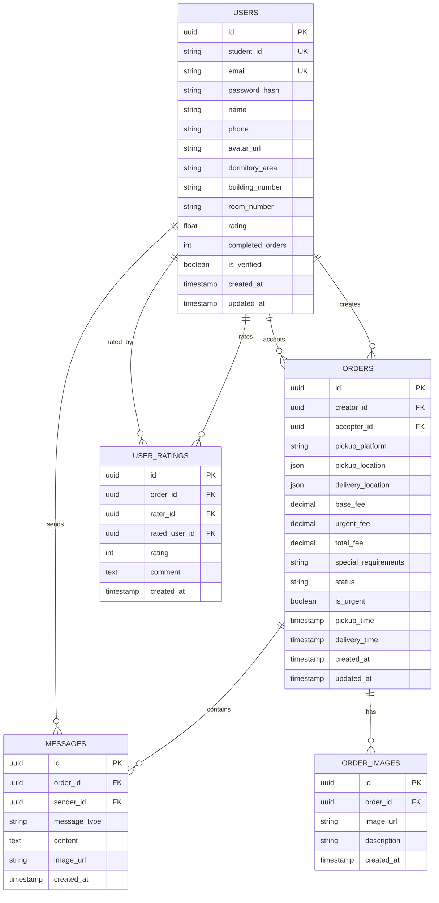

# 复旦外卖代取互助平台 - 技术架构文档

## 1. Architecture design



## 2. Technology Description

- Frontend: React@18 + TypeScript + Tailwind CSS@3 + Vite + React Router + Socket.io-client
- Backend: Node.js + Express@4 + TypeScript + Socket.io + Multer
- Database: Supabase (PostgreSQL)
- External Services: 高德地图API, 阿里云OSS

## 3. Route definitions

| Route | Purpose |
|-------|---------|
| / | 首页，显示地图和实时订单信息 |
| /post-order | 发单页面，用户发布代取需求 |
| /order-hall | 订单大厅，显示所有可接订单 |
| /order/:id | 订单详情页，显示具体订单信息和聊天 |
| /profile | 个人中心，用户信息和历史记录 |
| /messages | 消息中心，通知和聊天记录 |
| /login | 登录页面，用户身份验证 |
| /register | 注册页面，新用户注册 |

## 4. API definitions

### 4.1 Core API

用户认证相关
```
POST /api/auth/register
```

Request:
| Param Name| Param Type  | isRequired  | Description |
|-----------|-------------|-------------|-------------|
| student_id| string      | true        | 复旦学号 |
| email     | string      | true        | 复旦邮箱 |
| password  | string      | true        | 密码 |
| name      | string      | true        | 真实姓名 |
| phone     | string      | true        | 手机号码 |

Response:
| Param Name| Param Type  | Description |
|-----------|-------------|-------------|
| success   | boolean     | 注册是否成功 |
| user      | object      | 用户信息 |
| token     | string      | JWT令牌 |

订单管理相关
```
POST /api/orders
```

Request:
| Param Name    | Param Type  | isRequired  | Description |
|---------------|-------------|-------------|-------------|
| pickup_location| object     | true        | 取餐地点信息 |
| delivery_location| object   | true        | 配送地点信息 |
| platform      | string      | true        | 外卖平台 |
| base_fee      | number      | true        | 基础代取费 |
| urgent_fee    | number      | false       | 加急费 |
| special_requirements| string| false       | 特殊要求 |
| images        | array       | false       | 图片URLs |

```
GET /api/orders
```

Response:
| Param Name| Param Type  | Description |
|-----------|-------------|-------------|
| orders    | array       | 订单列表 |
| total     | number      | 订单总数 |

实时通讯相关
```
WebSocket /socket.io
```

Events:
- `join_order`: 加入订单聊天室
- `send_message`: 发送消息
- `order_status_update`: 订单状态更新
- `new_order_notification`: 新订单通知

地图和位置相关
```
GET /api/locations/buildings
```

Response:
| Param Name| Param Type  | Description |
|-----------|-------------|-------------|
| buildings | array       | 宿舍楼信息列表 |

```
GET /api/orders/nearby
```

Request:
| Param Name| Param Type  | isRequired  | Description |
|-----------|-------------|-------------|-------------|
| latitude  | number      | true        | 纬度 |
| longitude | number      | true        | 经度 |
| radius    | number      | false       | 搜索半径(米) |

## 5. Server architecture diagram



## 6. Data model

### 6.1 Data model definition



### 6.2 Data Definition Language

用户表 (users)
```sql
-- 创建用户表
CREATE TABLE users (
    id UUID PRIMARY KEY DEFAULT gen_random_uuid(),
    student_id VARCHAR(20) UNIQUE NOT NULL,
    email VARCHAR(255) UNIQUE NOT NULL,
    password_hash VARCHAR(255) NOT NULL,
    name VARCHAR(100) NOT NULL,
    phone VARCHAR(20) NOT NULL,
    avatar_url TEXT,
    dormitory_area VARCHAR(20) NOT NULL CHECK (dormitory_area IN ('东区', '南区', '北区', '本部')),
    building_number VARCHAR(10),
    room_number VARCHAR(10),
    rating DECIMAL(3,2) DEFAULT 5.00,
    completed_orders INTEGER DEFAULT 0,
    is_verified BOOLEAN DEFAULT false,
    created_at TIMESTAMP WITH TIME ZONE DEFAULT NOW(),
    updated_at TIMESTAMP WITH TIME ZONE DEFAULT NOW()
);

-- 创建索引
CREATE INDEX idx_users_student_id ON users(student_id);
CREATE INDEX idx_users_dormitory_area ON users(dormitory_area);
CREATE INDEX idx_users_rating ON users(rating DESC);

-- 权限设置
GRANT SELECT ON users TO anon;
GRANT ALL PRIVILEGES ON users TO authenticated;
```

订单表 (orders)
```sql
-- 创建订单表
CREATE TABLE orders (
    id UUID PRIMARY KEY DEFAULT gen_random_uuid(),
    creator_id UUID NOT NULL REFERENCES users(id) ON DELETE CASCADE,
    accepter_id UUID REFERENCES users(id) ON DELETE SET NULL,
    pickup_platform VARCHAR(50) NOT NULL,
    pickup_location JSONB NOT NULL,
    delivery_location JSONB NOT NULL,
    base_fee DECIMAL(10,2) NOT NULL,
    urgent_fee DECIMAL(10,2) DEFAULT 0,
    total_fee DECIMAL(10,2) GENERATED ALWAYS AS (base_fee + urgent_fee) STORED,
    special_requirements TEXT,
    status VARCHAR(20) DEFAULT 'pending' CHECK (status IN ('pending', 'accepted', 'picking', 'delivering', 'completed', 'cancelled')),
    is_urgent BOOLEAN DEFAULT false,
    pickup_time TIMESTAMP WITH TIME ZONE,
    delivery_time TIMESTAMP WITH TIME ZONE,
    created_at TIMESTAMP WITH TIME ZONE DEFAULT NOW(),
    updated_at TIMESTAMP WITH TIME ZONE DEFAULT NOW()
);

-- 创建索引
CREATE INDEX idx_orders_creator_id ON orders(creator_id);
CREATE INDEX idx_orders_accepter_id ON orders(accepter_id);
CREATE INDEX idx_orders_status ON orders(status);
CREATE INDEX idx_orders_created_at ON orders(created_at DESC);
CREATE INDEX idx_orders_pickup_location ON orders USING GIN (pickup_location);
CREATE INDEX idx_orders_delivery_location ON orders USING GIN (delivery_location);

-- 权限设置
GRANT SELECT ON orders TO anon;
GRANT ALL PRIVILEGES ON orders TO authenticated;
```

消息表 (messages)
```sql
-- 创建消息表
CREATE TABLE messages (
    id UUID PRIMARY KEY DEFAULT gen_random_uuid(),
    order_id UUID NOT NULL REFERENCES orders(id) ON DELETE CASCADE,
    sender_id UUID NOT NULL REFERENCES users(id) ON DELETE CASCADE,
    message_type VARCHAR(20) DEFAULT 'text' CHECK (message_type IN ('text', 'image', 'system')),
    content TEXT,
    image_url TEXT,
    created_at TIMESTAMP WITH TIME ZONE DEFAULT NOW()
);

-- 创建索引
CREATE INDEX idx_messages_order_id ON messages(order_id);
CREATE INDEX idx_messages_sender_id ON messages(sender_id);
CREATE INDEX idx_messages_created_at ON messages(created_at DESC);

-- 权限设置
GRANT SELECT ON messages TO anon;
GRANT ALL PRIVILEGES ON messages TO authenticated;
```

订单图片表 (order_images)
```sql
-- 创建订单图片表
CREATE TABLE order_images (
    id UUID PRIMARY KEY DEFAULT gen_random_uuid(),
    order_id UUID NOT NULL REFERENCES orders(id) ON DELETE CASCADE,
    image_url TEXT NOT NULL,
    description TEXT,
    created_at TIMESTAMP WITH TIME ZONE DEFAULT NOW()
);

-- 创建索引
CREATE INDEX idx_order_images_order_id ON order_images(order_id);

-- 权限设置
GRANT SELECT ON order_images TO anon;
GRANT ALL PRIVILEGES ON order_images TO authenticated;
```

用户评价表 (user_ratings)
```sql
-- 创建用户评价表
CREATE TABLE user_ratings (
    id UUID PRIMARY KEY DEFAULT gen_random_uuid(),
    order_id UUID NOT NULL REFERENCES orders(id) ON DELETE CASCADE,
    rater_id UUID NOT NULL REFERENCES users(id) ON DELETE CASCADE,
    rated_user_id UUID NOT NULL REFERENCES users(id) ON DELETE CASCADE,
    rating INTEGER NOT NULL CHECK (rating >= 1 AND rating <= 5),
    comment TEXT,
    created_at TIMESTAMP WITH TIME ZONE DEFAULT NOW(),
    UNIQUE(order_id, rater_id, rated_user_id)
);

-- 创建索引
CREATE INDEX idx_user_ratings_rated_user_id ON user_ratings(rated_user_id);
CREATE INDEX idx_user_ratings_order_id ON user_ratings(order_id);

-- 权限设置
GRANT SELECT ON user_ratings TO anon;
GRANT ALL PRIVILEGES ON user_ratings TO authenticated;
```

初始化数据
```sql
-- 插入宿舍楼信息（示例数据）
INSERT INTO dormitory_buildings (area, building_number, building_name, latitude, longitude) VALUES
('东区', '11', '11号楼', 31.2989, 121.5015),
('东区', '12', '12号楼', 31.2991, 121.5017),
('东区', '13', '13号楼', 31.2993, 121.5019),
('南区', '1', '1号楼', 31.2975, 121.5025),
('南区', '2', '2号楼', 31.2977, 121.5027),
('北区', '21', '21号楼', 31.3005, 121.5005),
('北区', '22', '22号楼', 31.3007, 121.5007),
('本部', '301', '301楼', 31.2960, 121.5040);
```