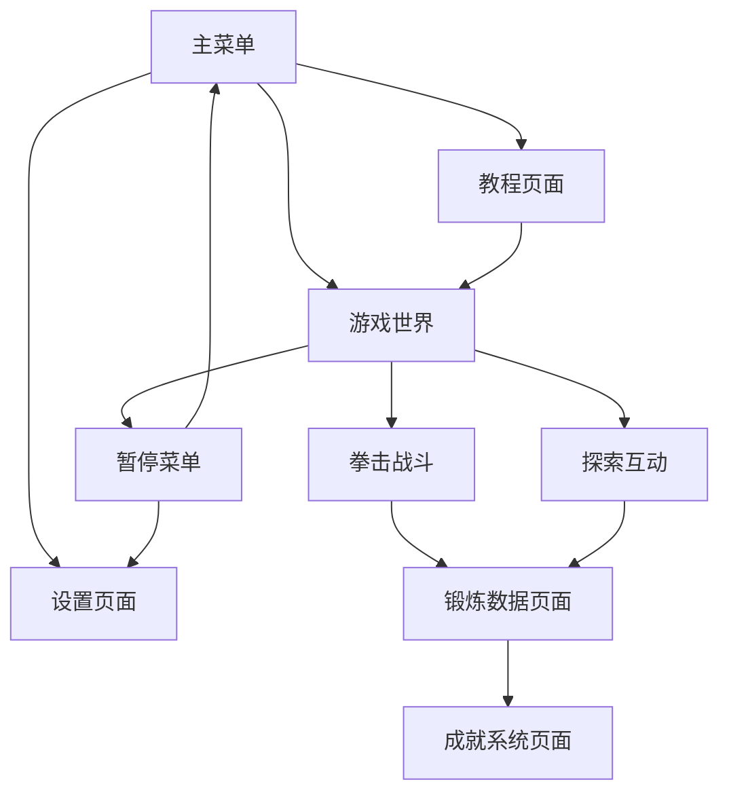

# 拳击开放世界锻炼游戏 - 产品需求文档

## 1. Product Overview

拳击开放世界锻炼游戏是一款以"健康冒险两不误"为核心定位的第一人称视角体感健身游戏，将传统枯燥的锻炼方式与沉浸式开放世界探索完美融合。

该游戏解决了目标用户在"锻炼形式枯燥与动力不足"、"时间碎片化与锻炼门槛过高"、"锻炼效果模糊与目标感缺失"三大核心痛点，通过手柄体感操作让用户在探索虚拟世界的同时完成真实的拳击锻炼。

产品目标是成为轻量化健身游戏领域的创新标杆，服务学生、白领、轻度玩家等群体，让运动不再是"任务"，而是游戏体验的自然组成部分。

## 2. Core Features

### 2.1 User Roles

| Role | Registration Method | Core Permissions |
|------|---------------------|------------------|
| 普通玩家 | 邮箱注册或游客模式 | 基础游戏体验、锻炼数据记录、成就解锁 |
| 注册用户 | 邮箱注册+个人信息 | 数据云端同步、社交功能、个性化设置 |

### 2.2 Feature Module

我们的拳击开放世界锻炼游戏包含以下主要页面：

1. **主菜单页面**：游戏启动、用户登录、设置选项、教程入口
2. **游戏世界页面**：第一人称开放世界、拳击战斗、探索互动
3. **锻炼数据页面**：运动量统计、卡路里消耗、动作分析
4. **成就系统页面**：解锁成就、进度追踪、奖励展示
5. **设置页面**：手柄配置、难度调节、音效设置
6. **教程页面**：操作指导、动作演示、安全提醒

### 2.3 Page Details

| Page Name | Module Name | Feature description |
|-----------|-------------|---------------------|
| 主菜单页面 | 游戏启动 | 显示游戏Logo、背景音乐、快速开始按钮、继续游戏选项 |
| 主菜单页面 | 用户系统 | 登录注册入口、游客模式、用户头像显示 |
| 主菜单页面 | 设置入口 | 游戏设置、手柄配置、音效调节快捷入口 |
| 游戏世界页面 | 开放世界探索 | 第一人称视角、3D场景漫游、物品交互、区域解锁 |
| 游戏世界页面 | 拳击战斗系统 | 手柄体感操作、左右拳击、组合拳、闪避动作 |
| 游戏世界页面 | 敌人AI系统 | 慵懒小怪、嗜睡巨怪、智能攻击模式、难度递增 |
| 游戏世界页面 | 剧情任务 | 主线任务引导、支线探索、NPC对话、故事推进 |
| 锻炼数据页面 | 运动统计 | 实时卡路里消耗、拳击次数统计、运动时长记录 |
| 锻炼数据页面 | 动作分析 | 拳击动作准确度、力度分析、改进建议 |
| 锻炼数据页面 | 历史数据 | 每日运动记录、周月统计、进步趋势图表 |
| 成就系统页面 | 成就解锁 | 战斗成就、探索成就、健身成就、特殊挑战 |
| 成就系统页面 | 进度追踪 | 当前进度显示、下一目标提示、完成度百分比 |
| 成就系统页面 | 奖励系统 | 虚拟奖品、皮肤解锁、称号获得、经验值奖励 |
| 设置页面 | 手柄配置 | 手柄连接检测、按键映射、灵敏度调节、校准功能 |
| 设置页面 | 游戏设置 | 难度选择、画质调节、音效控制、语言切换 |
| 教程页面 | 操作指导 | 手柄使用方法、基础拳击动作、移动控制教学 |
| 教程页面 | 安全提醒 | 运动前热身、空间安全、适度锻炼建议 |

## 3. Core Process

### 新手用户流程
用户首次进入游戏，观看简短的世界观介绍动画，进入教程模式学习基础操作（手柄连接、基础拳击、移动控制），完成新手引导任务后正式进入开放世界，开始探索"活力街区"并与第一个"慵懒小怪"战斗。

### 日常游戏流程
用户登录游戏后，可选择继续主线剧情或自由探索，通过拳击战斗击败各种敌人，收集"活力结晶"解锁新区域，实时查看锻炼数据和卡路里消耗，完成每日挑战获得成就奖励，游戏结束后查看运动总结。

## 4. User Interface Design

### 4.1 Design Style

- **主色调**：活力橙 (#FF6B35) 作为主色，深蓝 (#1A365D) 作为辅助色，白色 (#FFFFFF) 作为背景
- **辅助色**：绿色 (#48BB78) 用于健康数据，红色 (#E53E3E) 用于警告提示，灰色 (#718096) 用于次要信息
- **按钮样式**：圆角矩形按钮，主按钮使用渐变效果和阴影，悬停时有缩放动画
- **字体**：中文使用思源黑体，英文使用 Roboto，主标题 24px，正文 16px，说明文字 14px
- **布局风格**：现代扁平化设计，卡片式布局，充分利用空间，响应式适配
- **图标风格**：线性图标配合填充效果，统一使用 Feather Icons 图标库，运动主题图标

### 4.2 Page Design Overview

| Page Name | Module Name | UI Elements |
|-----------|-------------|-------------|
| 主菜单页面 | 整体布局 | 全屏背景视频，中央Logo动画，底部按钮组，右上角用户信息，渐变遮罩效果 |
| 游戏世界页面 | HUD界面 | 左上角血量条，右上角计时器，底部技能栏，中央准星，半透明背景 |
| 游戏世界页面 | 战斗界面 | 敌人血量条，连击数显示，拳击力度指示器，震动反馈提示 |
| 锻炼数据页面 | 数据展示 | 圆形进度条，折线图表，数字动画效果，颜色编码分类，卡片式布局 |
| 成就系统页面 | 成就展示 | 网格布局，徽章图标，进度条，解锁动画，分类标签 |
| 设置页面 | 控制面板 | 分组设置项，滑块控件，开关按钮，实时预览，重置按钮 |

### 4.3 Responsiveness

游戏采用Web端优先设计，支持桌面浏览器全屏运行，兼容1920x1080、1366x768等主流分辨率。界面元素采用相对单位设计，确保在不同屏幕尺寸下的良好显示效果。支持键盘快捷键操作，针对手柄连接状态提供不同的交互方式。