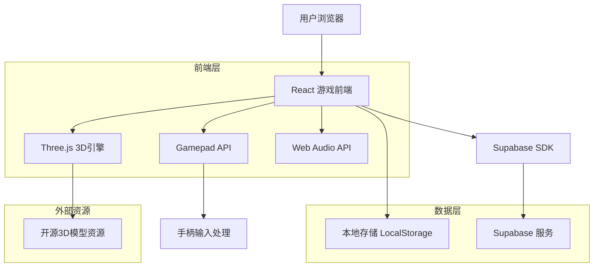
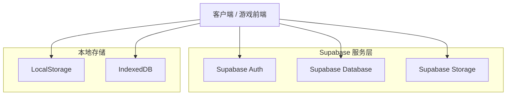
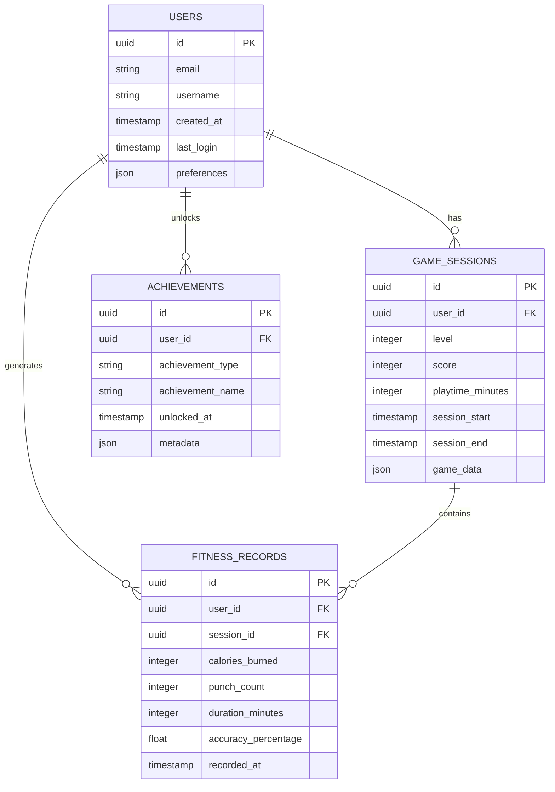

# 拳击开放世界锻炼游戏 - 技术架构文档

## 1. Architecture design



## 2. Technology Description

* 前端：React\@18 + TypeScript + Three.js + Vite

* 3D引擎：Three.js + React Three Fiber

* 输入处理：Gamepad API + 自定义手柄映射

* 音频：Web Audio API + Howler.js

* 数据存储：Supabase (PostgreSQL) + LocalStorage

* 构建工具：Vite + TypeScript

## 3. Route definitions

| Route         | Purpose            |
| ------------- | ------------------ |
| /             | 主菜单页面，游戏启动入口和用户登录  |
| /tutorial     | 教程页面，新手指导和操作学习     |
| /game         | 游戏世界页面，主要游戏体验和拳击战斗 |
| /stats        | 锻炼数据页面，运动统计和健康分析   |
| /achievements | 成就系统页面，进度追踪和奖励展示   |
| /settings     | 设置页面，游戏配置和手柄设置     |

## 4. API definitions

### 4.1 Core API

用户认证相关

```
POST /api/auth/login
```

Request:

| Param Name | Param Type | isRequired | Description |
| ---------- | ---------- | ---------- | ----------- |
| email      | string     | true       | 用户邮箱        |
| password   | string     | true       | 用户密码        |

Response:

| Param Name | Param Type | Description |
| ---------- | ---------- | ----------- |
| success    | boolean    | 登录是否成功      |
| user       | object     | 用户信息对象      |
| token      | string     | 认证令牌        |

游戏数据同步

```
POST /api/game/save-progress
```

Request:

| Param Name | Param Type | isRequired | Description |
| ---------- | ---------- | ---------- | ----------- |
| user\_id   | string     | true       | 用户ID        |
| level      | number     | true       | 当前关卡        |
| score      | number     | true       | 游戏分数        |
| playtime   | number     | true       | 游戏时长(分钟)    |

锻炼数据记录

```
POST /api/fitness/record
```

Request:

| Param Name | Param Type | isRequired | Description |
| ---------- | ---------- | ---------- | ----------- |
| user\_id   | string     | true       | 用户ID        |
| calories   | number     | true       | 消耗卡路里       |
| punches    | number     | true       | 拳击次数        |
| duration   | number     | true       | 锻炼时长(分钟)    |
| accuracy   | number     | true       | 动作准确度(%)    |

Example

```json
{
  "user_id": "user123",
  "calories": 150,
  "punches": 320,
  "duration": 25,
  "accuracy": 85.5
}
```

## 5. Server architecture diagram



## 6. Data model

### 6.1 Data model definition



### 6.2 Data Definition Language

用户表 (users)

```sql
-- 创建用户表
CREATE TABLE users (
    id UUID PRIMARY KEY DEFAULT gen_random_uuid(),
    email VARCHAR(255) UNIQUE NOT NULL,
    username VARCHAR(100) NOT NULL,
    created_at TIMESTAMP WITH TIME ZONE DEFAULT NOW(),
    last_login TIMESTAMP WITH TIME ZONE DEFAULT NOW(),
    preferences JSONB DEFAULT '{}'::jsonb
);

-- 游戏会话表
CREATE TABLE game_sessions (
    id UUID PRIMARY KEY DEFAULT gen_random_uuid(),
    user_id UUID REFERENCES users(id) ON DELETE CASCADE,
    level INTEGER DEFAULT 1,
    score INTEGER DEFAULT 0,
    playtime_minutes INTEGER DEFAULT 0,
    session_start TIMESTAMP WITH TIME ZONE DEFAULT NOW(),
    session_end TIMESTAMP WITH TIME ZONE,
    game_data JSONB DEFAULT '{}'::jsonb
);

-- 健身记录表
CREATE TABLE fitness_records (
    id UUID PRIMARY KEY DEFAULT gen_random_uuid(),
    user_id UUID REFERENCES users(id) ON DELETE CASCADE,
    session_id UUID REFERENCES game_sessions(id) ON DELETE SET NULL,
    calories_burned INTEGER DEFAULT 0,
    punch_count INTEGER DEFAULT 0,
    duration_minutes INTEGER DEFAULT 0,
    accuracy_percentage FLOAT DEFAULT 0.0,
    recorded_at TIMESTAMP WITH TIME ZONE DEFAULT NOW()
);

-- 成就表
CREATE TABLE achievements (
    id UUID PRIMARY KEY DEFAULT gen_random_uuid(),
    user_id UUID REFERENCES users(id) ON DELETE CASCADE,
    achievement_type VARCHAR(50) NOT NULL,
    achievement_name VARCHAR(100) NOT NULL,
    unlocked_at TIMESTAMP WITH TIME ZONE DEFAULT NOW(),
    metadata JSONB DEFAULT '{}'::jsonb
);

-- 创建索引
CREATE INDEX idx_game_sessions_user_id ON game_sessions(user_id);
CREATE INDEX idx_fitness_records_user_id ON fitness_records(user_id);
CREATE INDEX idx_fitness_records_session_id ON fitness_records(session_id);
CREATE INDEX idx_achievements_user_id ON achievements(user_id);
CREATE INDEX idx_fitness_records_recorded_at ON fitness_records(recorded_at DESC);

-- 权限设置
GRANT SELECT ON users TO anon;
GRANT ALL PRIVILEGES ON users TO authenticated;
GRANT ALL PRIVILEGES ON game_sessions TO authenticated;
GRANT ALL PRIVILEGES ON fitness_records TO authenticated;
GRANT ALL PRIVILEGES ON achievements TO authenticated;

-- 初始化数据
INSERT INTO users (email, username) VALUES 
('demo@example.com', 'Demo Player'),
('test@example.com', 'Test User');

-- 插入示例成就类型
INSERT INTO achievements (user_id, achievement_type, achievement_name, metadata)
SELECT 
    (SELECT id FROM users WHERE email = 'demo@example.com'),
    'first_punch',
    '初次出拳',
    '{"description": "完成第一次拳击动作", "points": 10}'::jsonb;
```

