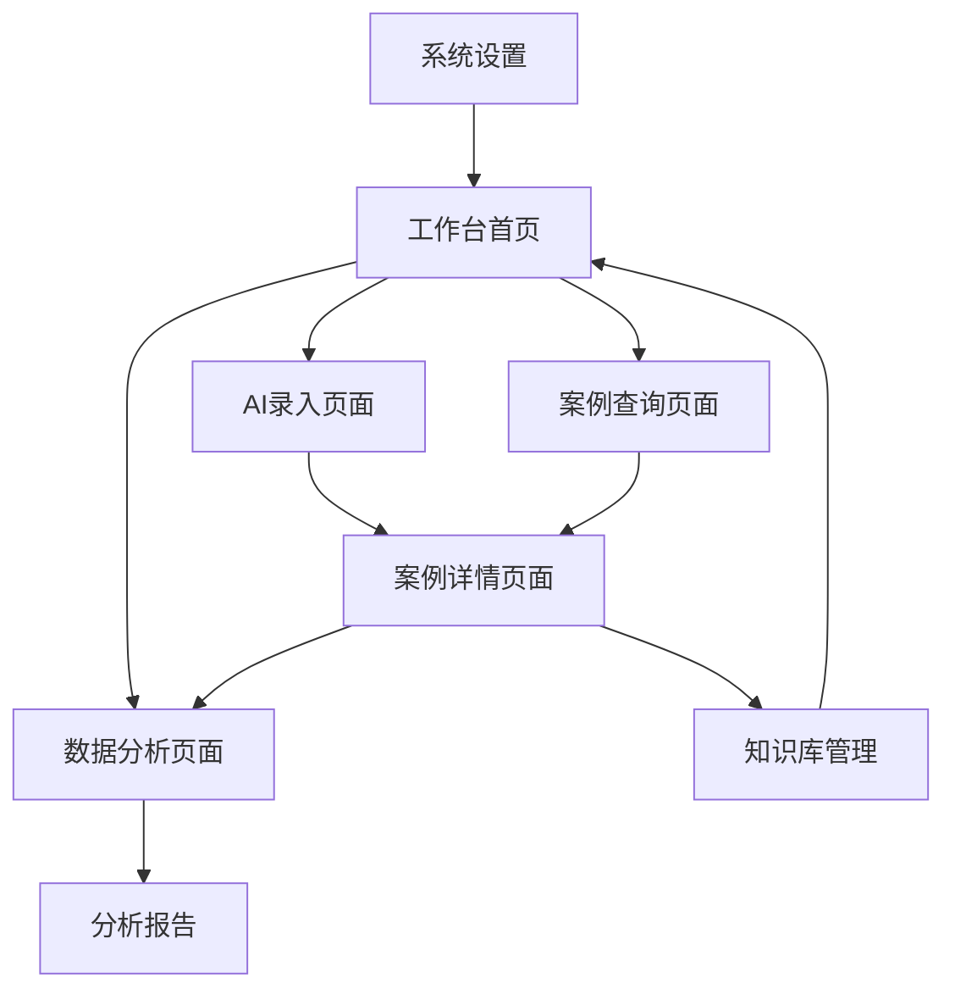

# 超自然司法案例库平台 - 产品需求文档

## 1. Product Overview

超自然司法案例库平台是一个专门用于收集、整理和分析中国古代涉及超自然力量（如鬼魂、托梦、显灵）司法案例的智能研究工具。该平台通过AI驱动的结构化录入、智能查询和数据分析功能，为法律史研究者提供高效的案例管理和研究支持。

平台解决了传统法律史研究中案例收集零散、信息提取困难、分析维度单一等核心问题，通过智能化的案例结构化处理和多维度分析，帮助研究者发现中国古代司法制度与超自然信仰之间的深层关联。

目标用户群体包括高校法律史研究者、历史学者、研究生以及对古代司法文化感兴趣的学术机构。平台致力于成为中国古代超自然司法案例研究的首选数字化工具。

## 2. Core Features

### 2.1 User Roles

| Role | Registration Method | Core Permissions |
|------|---------------------|------------------|
| 研究者 | 学术邮箱注册+机构验证 | 案例录入、查询分析、数据导出、团队协作 |
| 学生用户 | 学校邮箱注册 | 案例录入、基础查询、学习使用 |
| 访客用户 | 游客模式访问 | 浏览公开案例、基础查询功能 |

### 2.2 Feature Module

我们的超自然司法案例库平台包含以下主要功能模块：

1. **案例录入模块**：AI智能结构化提取、人工校验修正、批量导入处理
2. **智能查询模块**：多维度组合查询、自然语言搜索、智能推荐相关案例
3. **数据分析模块**：统计概览、可视化图表、趋势分析、关联性挖掘
4. **知识管理模块**：案例分类标签、文献出处管理、版本控制、协作审核
5. **系统管理模块**：用户权限管理、数据备份、系统配置、使用统计

### 2.3 Case Structure Framework

平台采用标准化的案例结构化框架，确保数据的一致性和可分析性：

**核心字段结构：**
- **案例名称**：简洁描述性标题
- **文献出处**：原始史料来源
- **朝代与年份**：历史时期精确标注
- **地点**：案发地理位置
- **核心案情**：事件经过详细描述
- **鬼魂互动方式**：托梦、显形、附体、异象、无形感应
- **司法功能**：启动报案、提供关键证据、指认凶手、警示官员、强化判决权威
- **官员应对策略**：验证型、借力型、规避型
- **案件类型**：谋杀、冤狱、财产纠纷、田土争议、通奸
- **证据状态**：无头案、证据链残缺、证据充足

### 2.4 AI Agent Capabilities

**智能体核心能力：**

1. **智能信息提取**：自动从非结构化文本中提取关键信息并结构化
2. **语义理解查询**：支持自然语言查询，理解复杂的学术提问
3. **智能推荐**：基于案例相似性推荐相关研究素材
4. **学术语言处理**：使用专业、严谨的学术语言进行交流
5. **数据分析洞察**：自动发现数据中的模式和趋势

## 3. Page Details

| Page Name | Module Name | Feature description |
|-----------|-------------|---------------------|
| 工作台首页 | 快速录入入口 | 提供AI智能录入入口，支持文本粘贴和文件上传，实时显示处理进度 |
| 工作台首页 | 统计概览面板 | 展示案例总数、本月新增、朝代分布、互动方式统计等关键指标 |
| 工作台首页 | 最近活动 | 显示最近的录入记录、查询历史和协作动态 |
| AI录入页面 | 智能提取 | 自动识别文本中的关键信息，生成结构化数据表格 |
| AI录入页面 | 人工校验 | 提供编辑界面让用户确认和修正AI提取的信息 |
| AI录入页面 | 文献管理 | 自动识别文献出处，建立文献引用数据库 |
| 案例查询页面 | 高级搜索 | 支持多维度组合查询，包括朝代、地点、案件类型等条件 |
| 案例查询页面 | 自然语言查询 | 支持用自然语言描述查询需求，AI理解并执行搜索 |
| 案例查询页面 | 结果展示 | 以卡片和表格形式展示查询结果，支持排序和筛选 |
| 数据分析页面 | 统计图表 | 提供柱状图、饼图、折线图等多种可视化方式 |
| 数据分析页面 | 趋势分析 | 展示不同时期的案例变化趋势和模式演变 |
| 数据分析页面 | 关联分析 | 分析不同维度之间的关联性和相关性 |
| 案例详情页面 | 完整信息展示 | 显示案例的所有结构化信息和原始文本 |
| 案例详情页面 | 相关案例推荐 | 基于相似性算法推荐相关的案例 |
| 案例详情页面 | 引用导出 | 支持生成标准格式的学术引用和案例摘要 |
| 知识库管理 | 分类标签管理 | 管理案例标签体系，支持自定义标签和层级分类 |
| 知识库管理 | 文献库维护 | 维护史料文献数据库，支持批量导入和元数据编辑 |
| 系统设置页面 | 用户权限配置 | 配置不同用户角色的权限范围和操作限制 |
| 系统设置页面 | 数据备份恢复 | 提供数据备份、导出和恢复功能 |

## 4. Core Process

### 研究者完整工作流程
用户登录后进入工作台首页，可以选择快速录入新案例或进行查询分析。录入新案例时，用户粘贴文本或上传文档，AI智能体自动提取结构化信息并展示预览，用户确认无误后保存入库。进行查询时，用户可以使用高级搜索或自然语言查询，系统返回相关案例列表，用户可以深入查看详情或进行批量分析。

### 数据分析流程
用户在数据分析页面选择分析维度和时间范围，系统自动生成统计图表和洞察报告。支持导出分析结果用于学术研究，也可以保存分析模板供后续使用。

## 5. User Interface Design

### 5.1 Design Style

- **主色调**：学术蓝 (#2563EB) 作为主色，深灰 (#1F2937) 作为文字主色，白色 (#FFFFFF) 作为背景
- **辅助色**：琥珀色 (#F59E0B) 用于强调和警告，绿色 (#10B981) 用于成功状态，红色 (#EF4444) 用于错误提示
- **按钮样式**：圆角矩形设计，主按钮使用填充色，次要按钮使用边框样式，悬停状态有轻微阴影
- **字体**：中文使用思源黑体，英文使用 Inter，标题 20-24px，正文 16px，辅助文字 14px
- **布局风格**：现代化卡片式设计，左侧导航栏，主内容区域采用网格布局，响应式适配
- **图标风格**：使用线性图标库，统一线条粗细和风格，学术主题的图标设计

### 5.2 Page Design Overview

| Page Name | Module Name | UI Elements |
|-----------|-------------|-------------|
| 工作台首页 | 整体布局 | 左侧导航栏包含主要功能入口，右侧主区域显示统计卡片和最近活动列表，顶部搜索栏 |
| AI录入页面 | 录入区域 | 大文本输入框支持多行粘贴，文件拖拽上传区域，实时处理进度条，结构化结果预览 |
| 案例查询页面 | 搜索界面 | 顶部搜索栏支持自然语言输入，左侧筛选面板包含多维度条件，右侧结果列表 |
| 数据分析页面 | 图表展示 | 全屏图表区域，顶部工具栏支持图表类型切换，右侧图例和筛选控件 |
| 案例详情页面 | 信息展示 | 顶部案例标题和基本信息，中部结构化数据表格，底部相关推荐和引用信息 |

### 5.3 Responsiveness

平台采用桌面端优先的响应式设计，主要适配大屏幕显示，同时兼容平板设备。支持键盘快捷键操作，针对学术用户的操作习惯进行优化。移动端提供简化版本，支持基础查询和浏览功能。

## 6. Demo操作流程

### 第一幕：AI结构化录入演示
用户进入AI录入页面，粘贴《折狱龟鉴》中的案例文本，AI智能体自动提取关键信息并生成结构化表格，用户确认信息准确后保存入库。截图展示AI提取的结构化结果表格。

### 第二幕：批量案例管理
展示用户连续录入多个案例的过程，包括宋代张贤案、清代争田案等典型案例。截图显示案例列表和管理界面，体现平台的批量处理能力。

### 第三幕：智能查询与总结
用户使用自然语言查询"所有通过托梦介入司法且官员采取验证型策略的案例"，系统快速返回精确匹配的结果并生成总结报告。截图展示查询结果和智能总结。

### 第四幕：数据分析可视化
用户请求统计概览，系统自动生成包含朝代分布、互动方式统计、案件类型分析等维度的图表报告。截图展示数据分析结果和可视化图表，体现平台的学术研究价值。