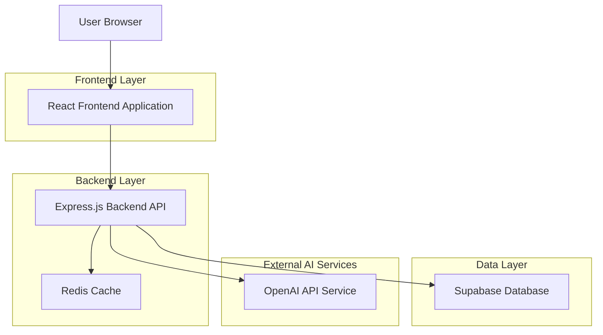
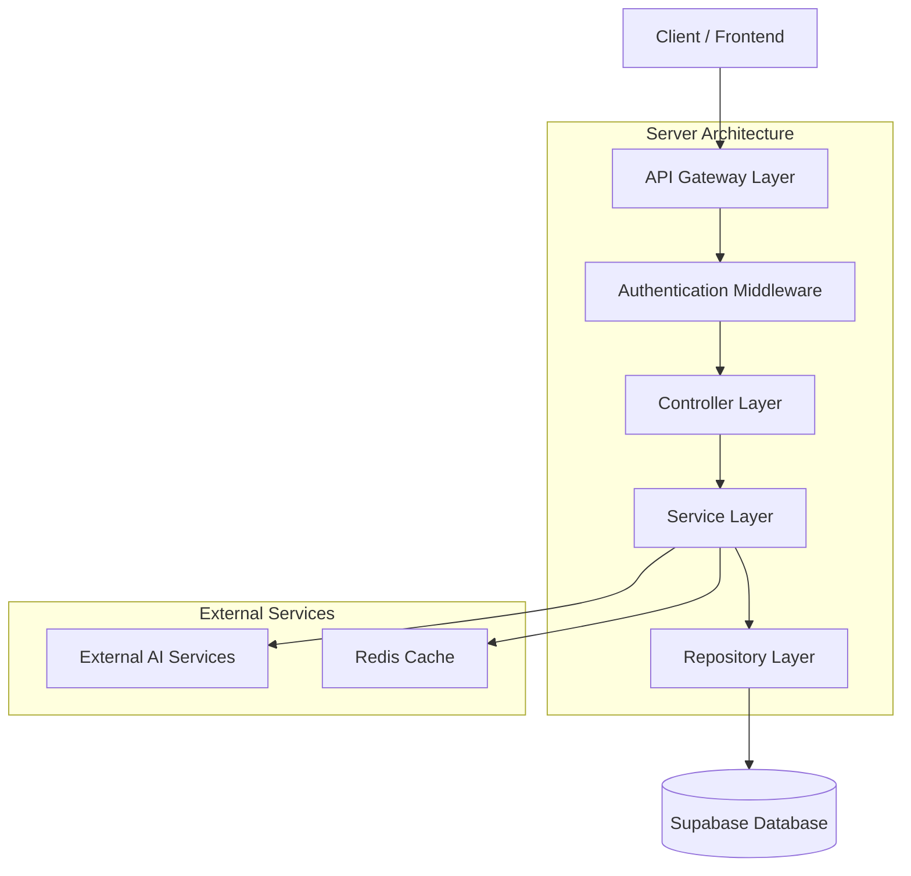
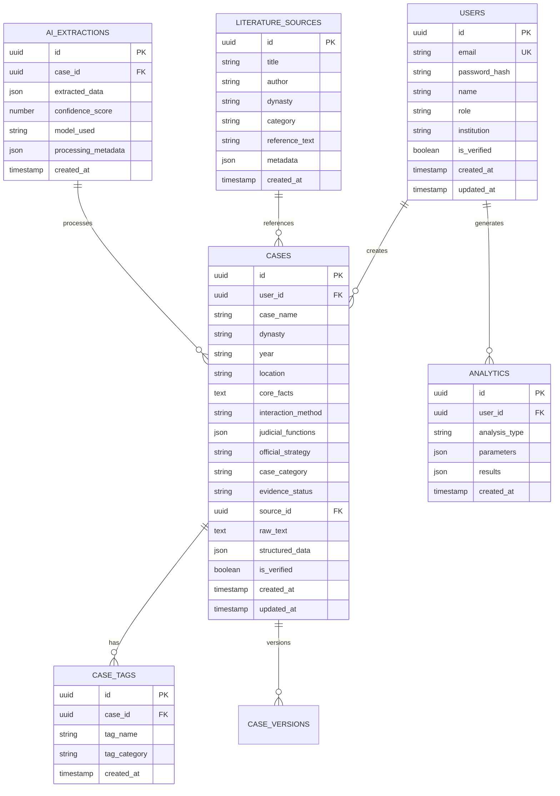

# 超自然司法案例库平台 - 技术架构文档

## 1. Architecture Design



## 2. Technology Description

- **Frontend**: React@18 + TypeScript + TailwindCSS@3 + Vite
- **Initialization Tool**: vite-init
- **Backend**: Express.js@4 + TypeScript + Node.js
- **Database**: Supabase (PostgreSQL)
- **AI Integration**: OpenAI GPT-4 API
- **Cache**: Redis
- **Authentication**: Supabase Auth
- **File Storage**: Supabase Storage

## 3. Route Definitions

| Route | Purpose |
|-------|---------|
| / | 工作台首页，显示统计概览和快速入口 |
| /login | 用户登录页面 |
| /register | 用户注册页面 |
| /dashboard | 用户工作台主页面 |
| /case/input | AI案例录入页面 |
| /case/search | 案例查询搜索页面 |
| /case/:id | 案例详情展示页面 |
| /analytics | 数据分析可视化页面 |
| /knowledge | 知识库管理页面 |
| /settings | 系统设置页面 |
| /api/auth/* | 认证相关API路由 |
| /api/cases/* | 案例管理API路由 |
| /api/analytics/* | 数据分析API路由 |
| /api/ai/* | AI处理相关API路由 |

## 4. API Definitions

### 4.1 案例管理API

**创建新案例**
```
POST /api/cases/create
```

Request:
| Param Name | Param Type | isRequired | Description |
|------------|------------|------------|-------------|
| raw_text | string | true | 原始案例文本 |
| source | string | false | 文献出处 |
| metadata | object | false | 额外元数据 |

Response:
| Param Name | Param Type | Description |
|------------|------------|-------------|
| success | boolean | 操作成功状态 |
| case_id | string | 生成的案例ID |
| structured_data | object | AI提取的结构化数据 |
| message | string | 处理结果信息 |

**查询案例列表**
```
GET /api/cases/search
```

Request Query Parameters:
| Param Name | Param Type | isRequired | Description |
|------------|------------|------------|-------------|
| keyword | string | false | 搜索关键词 |
| dynasty | string | false | 朝代筛选 |
| interaction_type | string | false | 互动方式筛选 |
| case_type | string | false | 案件类型筛选 |
| page | number | false | 页码，默认1 |
| limit | number | false | 每页数量，默认20 |

**获取案例详情**
```
GET /api/cases/:id
```

Response:
| Param Name | Param Type | Description |
|------------|------------|-------------|
| case_id | string | 案例唯一标识 |
| case_name | string | 案例名称 |
| dynasty | string | 朝代信息 |
| year | string | 年份 |
| location | string | 地点 |
| core_facts | string | 核心案情 |
| interaction_method | string | 鬼魂互动方式 |
| judicial_functions | array | 司法功能数组 |
| official_strategy | string | 官员应对策略 |
| case_category | string | 案件类型 |
| evidence_status | string | 证据状态 |
| source | string | 文献出处 |
| created_at | timestamp | 创建时间 |
| updated_at | timestamp | 更新时间 |

### 4.2 AI处理API

**AI结构化提取**
```
POST /api/ai/extract
```

Request:
| Param Name | Param Type | isRequired | Description |
|------------|------------|------------|-------------|
| text | string | true | 待处理的原始文本 |
| extraction_type | string | false | 提取类型，默认"complete" |

Response:
| Param Name | Param Type | Description |
|------------|------------|-------------|
| success | boolean | 处理成功状态 |
| extracted_data | object | 提取的结构化数据 |
| confidence_score | number | AI置信度评分 |
| processing_time | number | 处理耗时（毫秒） |

**智能查询分析**
```
POST /api/ai/analyze
```

Request:
| Param Name | Param Type | isRequired | Description |
|------------|------------|------------|-------------|
| query | string | true | 自然语言查询 |
| analysis_type | string | false | 分析类型：summary/statistical/comparative |

### 4.3 数据分析API

**获取统计概览**
```
GET /api/analytics/overview
```

Response:
| Param Name | Param Type | Description |
|------------|------------|-------------|
| total_cases | number | 案例总数 |
| dynasty_distribution | object | 朝代分布统计 |
| interaction_distribution | object | 互动方式分布 |
| case_type_distribution | object | 案件类型分布 |
| strategy_distribution | object | 官员策略分布 |
| monthly_trends | array | 月度趋势数据 |
| last_updated | timestamp | 最后更新时间 |

**生成分析报告**
```
POST /api/analytics/report
```

Request:
| Param Name | Param Type | isRequired | Description |
|------------|------------|------------|-------------|
| report_type | string | true | 报告类型：comprehensive/dynasty/interaction |
| time_range | object | false | 时间范围筛选 |
| filters | object | false | 额外筛选条件 |

## 5. Server Architecture Diagram



## 6. Data Model

### 6.1 数据模型定义



### 6.2 数据定义语言

**用户表 (users)**
```sql
-- 创建用户表
CREATE TABLE users (
    id UUID PRIMARY KEY DEFAULT gen_random_uuid(),
    email VARCHAR(255) UNIQUE NOT NULL,
    password_hash VARCHAR(255) NOT NULL,
    name VARCHAR(100) NOT NULL,
    role VARCHAR(20) DEFAULT 'researcher' CHECK (role IN ('admin', 'researcher', 'student', 'guest')),
    institution VARCHAR(255),
    is_verified BOOLEAN DEFAULT false,
    created_at TIMESTAMP WITH TIME ZONE DEFAULT NOW(),
    updated_at TIMESTAMP WITH TIME ZONE DEFAULT NOW()
);

-- 创建索引
CREATE INDEX idx_users_email ON users(email);
CREATE INDEX idx_users_role ON users(role);
CREATE INDEX idx_users_created_at ON users(created_at DESC);
```

**案例表 (cases)**
```sql
-- 创建案例表
CREATE TABLE cases (
    id UUID PRIMARY KEY DEFAULT gen_random_uuid(),
    user_id UUID REFERENCES users(id) ON DELETE CASCADE,
    case_name VARCHAR(255) NOT NULL,
    dynasty VARCHAR(50) NOT NULL,
    year VARCHAR(20),
    location VARCHAR(255),
    core_facts TEXT NOT NULL,
    interaction_method VARCHAR(50) CHECK (interaction_method IN ('托梦', '显形', '附体', '异象', '无形感应')),
    judicial_functions JSONB DEFAULT '[]',
    official_strategy VARCHAR(50) CHECK (official_strategy IN ('验证型', '借力型', '规避型')),
    case_category VARCHAR(50) CHECK (case_category IN ('谋杀', '冤狱', '财产纠纷', '田土争议', '通奸')),
    evidence_status VARCHAR(50) CHECK (evidence_status IN ('无头案', '证据链残缺', '证据充足')),
    source_id UUID REFERENCES literature_sources(id),
    raw_text TEXT NOT NULL,
    structured_data JSONB DEFAULT '{}',
    is_verified BOOLEAN DEFAULT false,
    created_at TIMESTAMP WITH TIME ZONE DEFAULT NOW(),
    updated_at TIMESTAMP WITH TIME ZONE DEFAULT NOW()
);

-- 创建索引
CREATE INDEX idx_cases_user_id ON cases(user_id);
CREATE INDEX idx_cases_dynasty ON cases(dynasty);
CREATE INDEX idx_cases_interaction_method ON cases(interaction_method);
CREATE INDEX idx_cases_case_category ON cases(case_category);
CREATE INDEX idx_cases_created_at ON cases(created_at DESC);
CREATE INDEX idx_cases_is_verified ON cases(is_verified);
```

**文献来源表 (literature_sources)**
```sql
-- 创建文献来源表
CREATE TABLE literature_sources (
    id UUID PRIMARY KEY DEFAULT gen_random_uuid(),
    title VARCHAR(255) NOT NULL,
    author VARCHAR(255),
    dynasty VARCHAR(50),
    category VARCHAR(100),
    reference_text TEXT,
    metadata JSONB DEFAULT '{}',
    created_at TIMESTAMP WITH TIME ZONE DEFAULT NOW()
);

-- 创建索引
CREATE INDEX idx_literature_title ON literature_sources(title);
CREATE INDEX idx_literature_dynasty ON literature_sources(dynasty);
CREATE INDEX idx_literature_category ON literature_sources(category);
```

**AI提取记录表 (ai_extractions)**
```sql
-- 创建AI提取记录表
CREATE TABLE ai_extractions (
    id UUID PRIMARY KEY DEFAULT gen_random_uuid(),
    case_id UUID REFERENCES cases(id) ON DELETE CASCADE,
    extracted_data JSONB NOT NULL,
    confidence_score DECIMAL(3,2) CHECK (confidence_score >= 0 AND confidence_score <= 1),
    model_used VARCHAR(100),
    processing_metadata JSONB DEFAULT '{}',
    created_at TIMESTAMP WITH TIME ZONE DEFAULT NOW()
);

-- 创建索引
CREATE INDEX idx_ai_extractions_case_id ON ai_extractions(case_id);
CREATE INDEX idx_ai_extractions_confidence ON ai_extractions(confidence_score DESC);
CREATE INDEX idx_ai_extractions_created_at ON ai_extractions(created_at DESC);
```

### 6.3 权限设置

```sql
-- 为匿名用户授予基础读取权限
GRANT SELECT ON cases TO anon;
GRANT SELECT ON literature_sources TO anon;

-- 为认证用户授予完整权限
GRANT ALL PRIVILEGES ON cases TO authenticated;
GRANT ALL PRIVILEGES ON literature_sources TO authenticated;
GRANT ALL PRIVILEGES ON case_tags TO authenticated;
GRANT ALL PRIVILEGES ON ai_extractions TO authenticated;
GRANT ALL PRIVILEGES ON analytics TO authenticated;

-- 初始数据插入
INSERT INTO literature_sources (title, author, dynasty, category, reference_text) VALUES
('折狱龟鉴', '郑克', '宋代', '法医学著作', '中国古代法医学经典著作，记录了众多司法案例'),
('阅微草堂笔记', '纪昀', '清代', '笔记小说', '清代文人笔记，包含大量民间故事和案例'),
('包公案', '佚名', '明代', '公案小说', '明代公案小说集，反映了当时的司法观念');
```

## 7. 部署配置

### 7.1 环境变量配置

```bash
# 数据库配置
SUPABASE_URL=your_supabase_url
SUPABASE_ANON_KEY=your_supabase_anon_key
SUPABASE_SERVICE_KEY=your_supabase_service_key

# OpenAI API配置
OPENAI_API_KEY=your_openai_api_key
OPENAI_MODEL=gpt-4-turbo-preview

# Redis配置
REDIS_URL=your_redis_url
REDIS_PASSWORD=your_redis_password

# 应用配置
NODE_ENV=production
PORT=3000
JWT_SECRET=your_jwt_secret_key
```

### 7.2 性能优化

- **数据库索引优化**：为高频查询字段建立复合索引
- **Redis缓存策略**：缓存热门查询结果和统计数据
- **API限流**：实施API调用频率限制，防止滥用
- **前端优化**：代码分割、懒加载、图片压缩等优化措施
- **CDN部署**：静态资源使用CDN加速分发